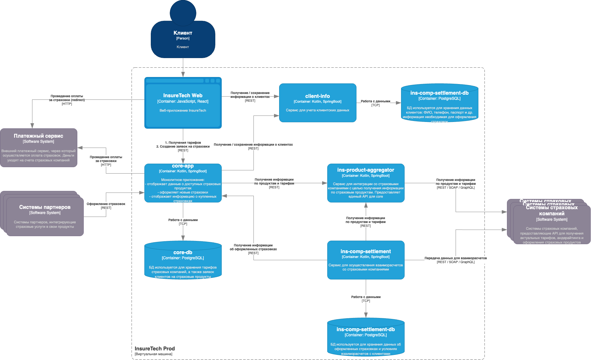

# Спринт 6

## Порядок запуска

Я использовал [uv](https://docs.astral.sh/uv/guides/install-python/) для управления средами python. Синтаксис манифеста аналогичен Poetry, но сам инструмент быстрее. Можно использовать и Poetry (но я не тестировал).

1. Запускаем

```bash
minikube start --addons=metrics-server
```

```console
😄  minikube v1.35.0 on Darwin 15.2 (arm64)
✨  Using the docker driver based on existing profile
👍  Starting "minikube" primary control-plane node in "minikube" cluster
🚜  Pulling base image v0.0.46 ...
🏃  Updating the running docker "minikube" container ...
🐳  Preparing Kubernetes v1.32.0 on Docker 27.4.1 ...
🔎  Verifying Kubernetes components...
    ▪ Using image gcr.io/k8s-minikube/storage-provisioner:v5
    ▪ Using image registry.k8s.io/metrics-server/metrics-server:v0.7.2
🌟  Enabled addons: default-storageclass, storage-provisioner, metrics-server

❗  /Users/pndvg/.local/bin/kubectl is version 1.30.7, which may have incompatibilities with Kubernetes 1.32.0.
    ▪ Want kubectl v1.32.0? Try 'minikube kubectl -- get pods -A'
🏄  Done! kubectl is now configured to use "minikube" cluster and "default" namespace by default
```

```bash
kubectl get pods -n kube-system | grep metrics-server
```

```console
metrics-server-7fbb699795-62tsg    1/1     Running   2 (5d15h ago)   5d17h
```

2. Применяем манифест горизонтального автомасштабирования

```yaml
cd manifests/
kubectl apply -f hpa-memory.yaml
kubectl get hpa
```

```console
NAME                          REFERENCE                            TARGETS                 MINPODS   MAXPODS   REPLICAS   AGE
scalable-pod-hpa-mem          Deployment/scalable-pod              memory: <unknown>/80%   1         10        1          5d16h
scalable-pod-hpa-rps          Deployment/scalable-pod              <unknown>/10 (avg)      1         10        1          5d16h
scalable-pod-identifier-hpa   Deployment/scalable-pod-identifier   memory: <unknown>/80%   1         10        0          5d18h
```

```bash
manifests % kubectl apply -f deployment.yaml               
deployment.apps/scalable-pod configured
manifests % kubectl apply -f service.yaml 
service/scalable-pod configured
manifests % kubectl apply -f hpa-memory.yaml 
horizontalpodautoscaler.autoscaling/scalable-pod-hpa-mem unchanged
% kubectl delete hpa scalable-pod-hpa-rps
horizontalpodautoscaler.autoscaling "scalable-pod-hpa-rps" deleted
% kubectl delete hpa scalable-pod-identifier-hpa
horizontalpodautoscaler.autoscaling "scalable-pod-identifier-hpa" deleted
% kubectl get hpa
NAME                   REFERENCE                 TARGETS          MINPODS   MAXPODS   REPLICAS   AGE
scalable-pod-hpa-mem   Deployment/scalable-pod   memory: 4%/80%   1         10        1          5d17h
```

## Описание кейса

Компания предоставляет агрегационные услуги в сфере страхования. Она работает с частными и корпоративными клиентами:

- частным клиентам компания предлагает удобный сайт для подбора и оформления страховок,
- корпоративным клиентам и партнёрам предоставляет API для интеграции страховых услуг в их продукты.

Сейчас основной продукт InsureTech — это страхование жизни.

## Проблемы компании

Компания успешно запустила MVP своего приложения и планирует активно развиваться дальше. Всё бы хорошо, но приложение столкнулось со всеми классическими проблемами быстрого роста:

1. **Сайт медленно загружает страницы.** Когда нагрузка на приложение повышается, пользователи массово жалуются на то, что страницы грузятся по несколько минут или не загружаются вообще. При этом максимально зафиксированная нагрузка на запросы поиска составила 50 RPS, а на запросы оформления — 10 RPS. Такое положение дел плохо влияет на показатели NPS и retention.

2. **Нарушается SLA для B2B-клиентов.** Менеджеры уже неоднократно получали сообщения от партнёров, что SLA API не соответствует заявленному. В ходе изучения таких инцидентов выяснилось, что в эти периоды количество запросов от одного из партнёров кратно возрастало. Оно достигало суммарно 250 RPS на все вызываемые операции. По сути, один из партнёров «сжирал» все ресурсы приложения. С этим партнёром изначально договорились, что нагрузка не будет превышать 20 RPS.

3. **Приложение падает.** InsureTech несколько раз столкнулась с проблемой недоступности приложения. Команда реагировала на проблему очень медленно, поскольку узнавала о ней от пользователей. Каждый час простоя сервис несёт финансовые убытки — примерно 500 тысяч рублей. Также бизнес несёт репутационные потери: в СМИ выходят негативные публикации, у сервиса низкие показатели удовлетворённости пользователей, а некоторые партнёры уже заявили о нежелании продлевать сотрудничество.

InsureTech планирует в ближайшее время провести большую рекламную кампанию. Ожидается существенный прирост пользователей.

Вам как архитектору нужно проработать описанные проблемы и предложить для них решения. В текущем состоянии приложение является «узким горлышком» для развития бизнеса.

## Архитектура приложения

Основные компоненты приложения:

- **core-app** — монолитное бэкенд-приложение. Оно отвечает за отображение доступных клиенту продуктов, оформление заявок на новые страховки и отображение уже оформленных.
- **client-info** — сервис управления клиентскими данными. Он передаёт данные core-app для оформления страховок. Если пользователя нет в базе данных или его данные изменились, в процессе оформления страховки сервис client-info вносит данные в базу. Он же отвечает за отображение и редактирование клиентских данных в личном кабинете.
- **ins-product-aggregator** — сервис интеграции со страховыми компаниями для получения информации о продуктах. Ещё он запрашивает у разных партнёров предложения по ОСАГО для конкретного автомобиля. Сервис предоставляет единый API, агрегируя данные от всех страховых компаний.
- **ins-comp-settlement** — сервис взаиморасчётов со страховыми компаниями. Раз в месяц он отправляет перечень оформленных страховок в страховые компании для расчёта выплаты агентских премий.
- **Веб-приложение** для клиентов сервиса.

Для деплоя всех приложений используется кластер **Kubernetes**, расположенный в одной зоне доступности.

В качестве базы данных используется **PostgreSQL**. Каждый сервис, использующий БД, имеет отдельную схему данных. БД развёрнута на отдельной ВМ в единственном экземпляре.

Взаимодействие между фронтендом и бэкендом происходит посредством REST.

API предоставляет партнёрам доступ напрямую через **LoadBalancer Kubernetes**, который доступен в сети Интернет.

Бэкенд-приложение интегрировано с пятью страховыми компаниями.

Вот диаграмма контейнеров приложения в модели C4:



